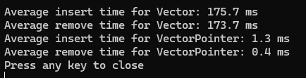

## Part 1: Custom Vectors

### Description

In this part, two custom vector classes are evaluated for their performance. The vector classes are:

- **`MyVector<T>`**: A custom vector class implementation using a direct approach with `T*`.
- **`MyVectorP<T>`**: An alternative vector class implementation that uses `T**`.

A large data object (`LargeObject`) is used to test the performance of `insert` and `remove` operations for both vector classes. Performance metrics are recorded using `std::clock()`.

### Results

The performance results are measured in terms of average time taken for insert and remove operations. The results are compared to evaluate the efficiency of each implementation.

The image above shows the comparison of average operation times between the two vector implementations. The `VectorPointer` implementation (`T**`) is faster than the `Vector` implementation (`T*`).

## Part 2: Device

### Description

This part involves implementing a `Device` class to model a hierarchical system of devices and shapes. Each `Device` can contain simple shapes (like cubes, spheres, cylinders, and pyramids) and other devices, reflecting a real-world scenario where devices can be composed of simpler or more complex parts.

The `Device` class includes functionalities to:
- Calculate the total volume, surface area, and mass of the device and its components.
- Manage nested devices and shapes, and compute aggregate properties considering all levels of hierarchy.

